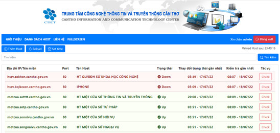
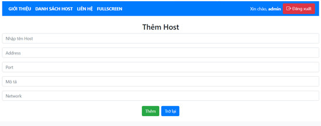
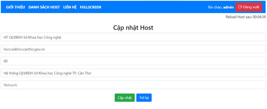
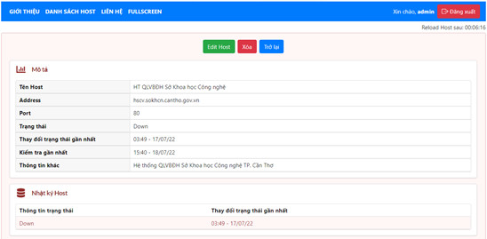
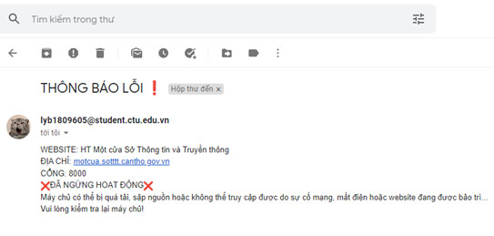
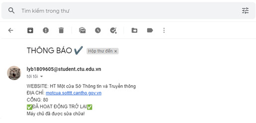
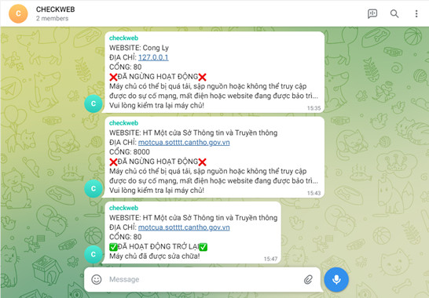
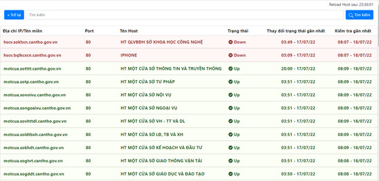

# Check-the-availability-of-Web-Based-Software
This is a tools to check the availability of Web-Based Software.
## Features of this Project

1. Login with Username and Password
2. Manage Host (Add, Update and Delete)
3. Reload Check
4. Set time Reload Check
5. Search Host
6. Send message to Email and Telegram when Web-Based change status


## ScreenShots


















## Install and Run this project

### Pre-Requisites:
1. Install Git Version Control
[ https://git-scm.com/ ]

2. Install Python Latest Version
[ https://www.python.org/downloads/ ]

3. Install Pip (Package Manager)
[ https://pip.pypa.io/en/stable/installing/ ]

*Alternative to Pip is Homebrew*

### Installation
**1. Create a Folder where you want to save the project**

**2. Create a Virtual Environment and Activate**

Install Virtual Environment First
```
$  pip install virtualenv
```

Create Virtual Environment

For Windows
```
$  python -m venv venv
```
For Mac
```
$  python3 -m venv venv
```
For Linux
```
$  virtualenv .
```

Activate Virtual Environment

For Windows
```
$  source venv/scripts/activate
```

For Mac
```
$  source venv/bin/activate
```

For Linux
```
$  source bin/activate
```

**3. Clone this project**
```
$  git clone https://github.com/CongLy-Dev/Check-the-availability-of-Web-Based-Software.git
```

Then, Enter the project
```
$  cd mysite
```

**4. Install Requirements from 'requirements.txt'**
```python
$  pip3 install -r requirements.txt
```

**5. Add the hosts**

- Got to settings.py file 
- Then, On allowed hosts, Use **[]** as your host. 
```python
ALLOWED_HOSTS = []
```
*Do not use the fault allowed settings in this repo. It has security risk!*


**6. Now Run Server**

Command for PC:
```python
$ python manage.py runserver
```

Command for Mac:
```python
$ python3 manage.py runserver
```

Command for Linux:
```python
$ python3 manage.py runserver
```

**7. Login Credentials**

Create Super User (Admin)
Command for PC:
```
$  python manage.py createsuperuser
```

Command for Mac:
```
$  python3 manage.py createsuperuser
```

Command for Linux:
```
$  python3 manage.py createsuperuser
```


Then Add Email and Password


